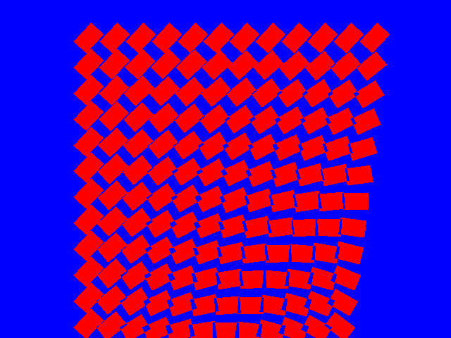
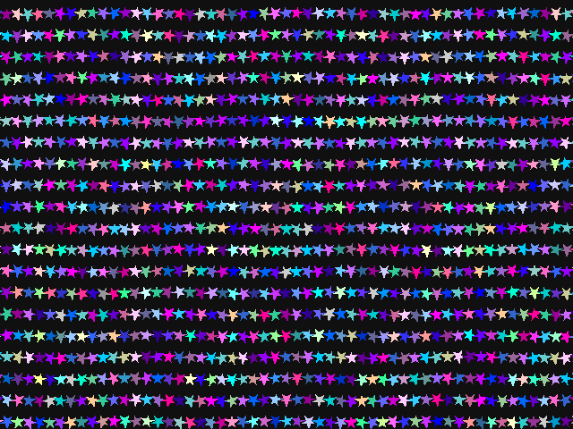

# V4P Automated Screenshot System

## Quick Start

Capture screenshots of your V4P demos with a single command:

```bash
make screenshots/demo_name.png
```

## Example

```bash
# Capture screenshot of the square demo
make screenshots/square.png

# Capture screenshot of the stars demo  
make screenshots/stars.png

# Capture screenshot of asteroids with 3 second delay
./tools/autocapture_screenshot_v2.sh asteroids screenshots/asteroids 3
```

## What You Get

- **Automatic building**: Compiles demo with Xlib backend
- **Automatic execution**: Runs demo in background
- **Automatic detection**: Finds the V4P window
- **Automatic capture**: Takes screenshot using X11 tools
- **Automatic cleanup**: Terminates demo process
- **PNG output**: Converts to web-friendly format

## Requirements

```bash
sudo apt-get install x11-utils xdotool coreutils imagemagick
```

## Available Demos

```bash
ls demos/*.c | sed 's|demos/||; s|\.c||g'
```

## GitHub Integration

1. **Capture screenshots**:
   ```bash
   make screenshots/square.png screenshots/stars.png screenshots/asteroids.png
   ```

2. **Add to git**:
   ```bash
   git add screenshots/
   git commit -m "Add demo screenshots"
   ```

3. **Update README**:
   ```markdown
   ## Demo Screenshots

   
   
   ```

## Technical Details

- **Backend**: Uses Xlib for X11 compatibility
- **Tools**: `xwd` for capture, `xdotool` for detection, `convert` for PNG
- **Process**: Build → Run → Detect → Capture → Convert → Cleanup
- **Format**: PNG output (web-friendly)
- **Timing**: 2 second default delay (adjustable)

## Troubleshooting

**Window not found?**
- Close other V4P windows first
- Make sure X11 is running
- Check demo builds successfully

**Missing dependencies?**
```bash
sudo apt-get install x11-utils xdotool coreutils imagemagick
```

**Permission issues?**
```bash
mkdir -p screenshots
chmod 755 screenshots
```

## Advanced Usage

```bash
# Custom delay for complex demos
./tools/autocapture_screenshot_v2.sh demo_name output_file 5

# Batch capture multiple demos
for demo in square stars asteroids; do
    make screenshots/$demo.png
Done

# Different output formats
./tools/autocapture_screenshot_v2.sh demo_name screenshots/demo_xwd
```

## Files Created

- `tools/autocapture_screenshot_v2.sh` - Main capture script
- `screenshots/*.png` - Screenshot outputs
- Makefile targets for easy integration

## System Requirements

- Linux with X11
- Xlib backend support
- Standard build tools (gcc, make)
- X11 utilities (xwd, xdotool)

## Performance

- **Fast**: ~5-10 seconds per screenshot
- **Reliable**: Automatic retry and error handling
- **Clean**: No manual process management needed
- **Scalable**: Works with any number of demos

## Limitations

- X11 only (not compatible with SDL, Emscripten, etc.)
- Requires graphical environment
- Window must be visible (not minimized)
- Demo must create a window with "v4p" in name/class

## Future Enhancements

Consider adding:
- Multiple delay options via Makefile
- Batch processing for all demos
- Different output formats (JPG, etc.)
- Window size/position control
- Video capture for animations